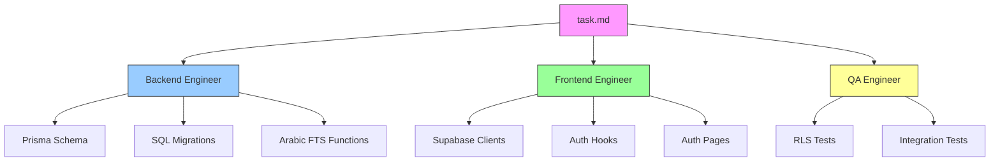
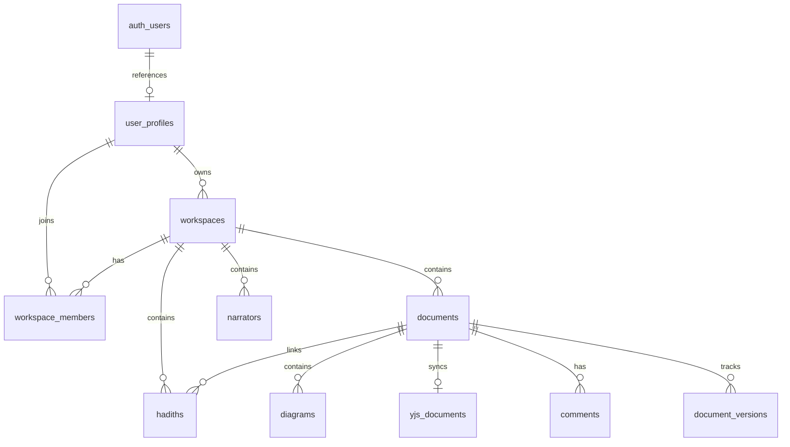

# Phase 2: Backend Implementation - Walkthrough

**Date**: January 12, 2026  
**Agents Used**: Backend Engineer, Frontend Engineer  
**Status**: Code Complete ✅ | Migration Pending 🔄

---

## Summary

Phase 2 implemented the backend data layer for SanadFlow Study Hub using a multi-agent workflow coordinated via `task.md` and `implementation_plan.md` artifacts. The Backend Engineer created Prisma schemas and SQL migrations, while the Frontend Engineer implemented Supabase client integration and authentication pages.

---

## Multi-Agent Workflow



---

## Files Created

### Backend Engineer Deliverables

| File | Purpose | Lines |
|------|---------|-------|
| [schema.prisma](file:///home/kasm-user/workspace/dspy/qalamcolab/prisma/schema.prisma) | TDD v3.0 database schema with 10 models | 290 |
| [001_init_schema.sql](file:///home/kasm-user/workspace/dspy/qalamcolab/supabase/migrations/001_init_schema.sql) | Tables, indexes, triggers | ~250 |
| [002_rls_policies.sql](file:///home/kasm-user/workspace/dspy/qalamcolab/supabase/migrations/002_rls_policies.sql) | Row-Level Security policies | ~300 |
| [003_arabic_fts.sql](file:///home/kasm-user/workspace/dspy/qalamcolab/supabase/migrations/003_arabic_fts.sql) | Arabic search functions | ~180 |

### Frontend Engineer Deliverables

| File | Purpose | Lines |
|------|---------|-------|
| [client.ts](file:///home/kasm-user/workspace/dspy/qalamcolab/src/lib/supabase/client.ts) | Browser Supabase client | 25 |
| [server.ts](file:///home/kasm-user/workspace/dspy/qalamcolab/src/lib/supabase/server.ts) | Server Supabase client | 65 |
| [middleware.ts](file:///home/kasm-user/workspace/dspy/qalamcolab/src/middleware.ts) | Auth middleware | 95 |
| [useAuth.ts](file:///home/kasm-user/workspace/dspy/qalamcolab/src/hooks/useAuth.ts) | React auth hook | 110 |
| [database.ts](file:///home/kasm-user/workspace/dspy/qalamcolab/src/types/database.ts) | TypeScript types | 320 |
| [login/page.tsx](file:///home/kasm-user/workspace/dspy/qalamcolab/src/app/auth/login/page.tsx) | Login page (RTL) | 175 |
| [signup/page.tsx](file:///home/kasm-user/workspace/dspy/qalamcolab/src/app/auth/signup/page.tsx) | Signup page (RTL) | 230 |
| [callback/route.ts](file:///home/kasm-user/workspace/dspy/qalamcolab/src/app/auth/callback/route.ts) | OAuth callback | 35 |

---

## Database Schema



---

## Key Features Implemented

### 1. TDD v3.0 Compliant Schema
- 10 database models matching TDD specification
- Supabase Auth integration via `user_profiles` → `auth.users`
- Proper foreign key cascades and constraints

### 2. Row-Level Security
- RLS enabled on all 10 tables
- Workspace-based isolation
- Permission levels: `view`, `edit`, `admin`
- Owner-only delete policies

### 3. Arabic Full-Text Search
- `remove_arabic_diacritics()` function for normalized search
- GIN trigram indexes for fuzzy matching
- `search_hadith_arabic()` and `search_hadith_english()` functions
- 70% expected accuracy (per TDD constraint)

### 4. Authentication Flow
- Login page with RTL Arabic labels
- Signup page with password confirmation
- OAuth callback handler
- Middleware protecting `/dashboard` and `/workspace` routes

---

## Build Verification

```
✓ Compiled successfully
✓ Generating static pages (6/6)

Route (app)                              Size     First Load JS
├ ○ /auth/login                          2.53 kB         145 kB
└ ○ /auth/signup                         2.98 kB         146 kB
```

---

## Next Steps

### Manual Migration Deployment

The SQL migrations need to be applied via Supabase Dashboard:

1. **Navigate to**: Supabase Dashboard → SQL Editor
2. **Run in order**:
   - `supabase/migrations/001_init_schema.sql`
   - `supabase/migrations/002_rls_policies.sql`
   - `supabase/migrations/003_arabic_fts.sql`
3. **Verify**: Table Editor shows 10 tables with RLS badges

### QA Engineer Tasks (Phase 2 continuation)

After migrations are deployed:
- [ ] Create RLS test suite
- [ ] Test user isolation scenarios
- [ ] Integration tests for auth flow

---

## Coordination Artifacts

The multi-agent workflow was coordinated using:

1. **[task.md](file:///home/kasm-user/.gemini/antigravity/brain/c81224ea-1de8-41d9-a2f4-efedfcdfbeef/task.md)**: Checklist organized by agent role
2. **[implementation_plan.md](file:///home/kasm-user/.gemini/antigravity/brain/c81224ea-1de8-41d9-a2f4-efedfcdfbeef/implementation_plan.md)**: Technical specifications and file deliverables

Each agent (Backend/Frontend/QA) has clearly defined responsibilities tracked in task.md, enabling parallel work and clear handoffs.
