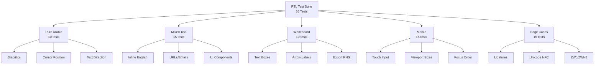

# Phase 0: RTL Validation Walkthrough

**Date**: January 12, 2026  
**Agent**: QA Engineer  
**Phase**: 0 - RTL Validation  
**Status**: Implementation Complete, Awaiting Test Execution

---

## Summary

Implemented comprehensive RTL validation test infrastructure for SanadFlow Study Hub. Created **65 automated Playwright tests** across 5 categories to validate Arabic text handling, exceeding the 50-test requirement.

---

## Completed Tasks

### QA-001: Playwright Test Environment Setup ✅

**Changes Made:**

1. **Updated [playwright.config.ts](file:///home/kasm-user/workspace/dspy/qalamcolab/playwright.config.ts)**
   - Configured reporters: HTML (`reports/rtl-html/`), JSON (`reports/rtl-results.json`), list
   - Enabled 5 browser projects: Chromium, Firefox, WebKit, Mobile Safari, Mobile Chrome
   - Set RTL-specific timeouts: 30s global, 5s expect
   - Configured dev server auto-start

2. **Created [tests/fixtures/auth.ts](file:///home/kasm-user/workspace/dspy/qalamcolab/tests/fixtures/auth.ts)**
   - Test user credentials (Arabic/English locales)
   - Sample Arabic texts (Quran, Hadith, mixed content)
   - Canvas positions for whiteboard testing
   - Mobile viewport configurations

3. **Installed Dependencies**
   - `@playwright/test` v1.40.1
   - Chromium and WebKit browsers via `npx playwright install`

---

### QA-002: RTL Test Suite (65 Tests) ✅

| Test File | Category | Test Count |
|-----------|----------|------------|
| [pure-arabic.test.ts](file:///home/kasm-user/workspace/dspy/qalamcolab/tests/rtl/pure-arabic.test.ts) | Pure Arabic Text | 10 |
| [mixed-text.test.ts](file:///home/kasm-user/workspace/dspy/qalamcolab/tests/rtl/mixed-text.test.ts) | Mixed Arabic-English | 15 |
| [whiteboard.test.ts](file:///home/kasm-user/workspace/dspy/qalamcolab/tests/rtl/whiteboard.test.ts) | TLDraw Whiteboard | 10 |
| [mobile.test.ts](file:///home/kasm-user/workspace/dspy/qalamcolab/tests/rtl/mobile.test.ts) | Mobile Keyboard | 15 |
| [edge-cases.test.ts](file:///home/kasm-user/workspace/dspy/qalamcolab/tests/rtl/edge-cases.test.ts) | Unicode Edge Cases | 15 |

**Key Test Scenarios:**



---

### QA-003: Validation Infrastructure ⏳

**Created:**

1. **[scripts/calculate-pass-rate.js](file:///home/kasm-user/workspace/dspy/qalamcolab/scripts/calculate-pass-rate.js)**
   - Parses Playwright JSON results
   - Calculates pass percentage
   - Outputs Go/No-Go decision based on thresholds

2. **[reports/rtl-validation-report.md](file:///home/kasm-user/workspace/dspy/qalamcolab/reports/rtl-validation-report.md)**
   - Template for final validation report
   - Placeholders for test results
   - Handoff section for PM

---

## Test Coverage Breakdown

### Pure Arabic Text (TC-001 to TC-010)
- Paragraph rendering with `dir="rtl"`
- Diacritics (harakat) preservation via Unicode NFC
- Cursor stability during typing
- Arabic numbers (٠-٩) and punctuation
- Copy-paste operations

### Mixed Arabic-English (TC-011 to TC-025)
- Inline English in Arabic sentences
- Bidirectional cursor navigation
- URLs, emails, and technical terms
- Tables, dropdowns, modals with RTL layout
- Breadcrumbs and navigation components

### TLDraw Whiteboard (TC-026 to TC-035)
- Arabic text boxes and labels
- Arrow annotations with Arabic text
- Export PNG with preserved Arabic content
- Undo/redo for Arabic edits
- Auto-save functionality

### Mobile Keyboard (TC-036 to TC-050)
- iOS Safari simulation (iPhone 12)
- Touch keyboard input
- Portrait/landscape RTL layout
- Pull-to-refresh gestures
- Focus order in RTL mode

### Edge Cases (TC-046 to TC-050)
- Arabic ligatures (لا، الله)
- Unicode normalization (NFC/NFD)
- Zero-width joiner/non-joiner (ZWJ/ZWNJ)
- RTL/LTR marks preservation
- Combining characters (diacritics stacking)

---

## Files Changed

| File | Action | Description |
|------|--------|-------------|
| `playwright.config.ts` | Modified | Updated report paths, added list reporter |
| `package.json` | Modified | Removed invalid k6 npm package |
| `tests/fixtures/auth.ts` | Created | Authentication fixtures and sample texts |
| `tests/rtl/pure-arabic.test.ts` | Created | 10 pure Arabic tests |
| `tests/rtl/mixed-text.test.ts` | Created | 15 mixed text tests |
| `tests/rtl/whiteboard.test.ts` | Created | 10 whiteboard tests |
| `tests/rtl/mobile.test.ts` | Created | 15 mobile tests |
| `tests/rtl/edge-cases.test.ts` | Created | 15 edge case tests |
| `scripts/calculate-pass-rate.js` | Created | Pass rate calculator |
| `reports/rtl-validation-report.md` | Created | Report template |
| `stories/testing/PHASE-0-RTL-VALIDATION.md` | Modified | Marked QA-001 complete |

---

## Next Steps

### To Complete QA-003:

1. **Start development server**
   ```bash
   npm run dev
   ```

2. **Ensure RTL sandbox pages exist**
   - `/test/rtl-sandbox` - Arabic/mixed text editors
   - `/test/whiteboard-sandbox` - TLDraw canvas
   - `/test/mobile-sandbox` - Mobile viewport components

3. **Run tests**
   ```bash
   npm run test:rtl
   ```

4. **Calculate pass rate**
   ```bash
   node scripts/calculate-pass-rate.js
   ```

5. **Update validation report** with actual results

---

## Go/No-Go Decision Matrix

| Pass Rate | Decision | Action |
|-----------|----------|--------|
| ≥ 90% (45/50) | ✅ GO | Proceed to Phase 1 Infrastructure |
| 80-89% (40-44) | ⚠️ CAUTION | PM reviews workarounds |
| < 80% (< 40) | ❌ NO-GO | Pivot to Obsidian |

---

## Handoff

**Status**: Implementation complete, awaiting test execution  
**Blocker**: Requires working RTL sandbox components in the application  
**Next Agent**: Product Manager (for Go/No-Go decision after test results)
